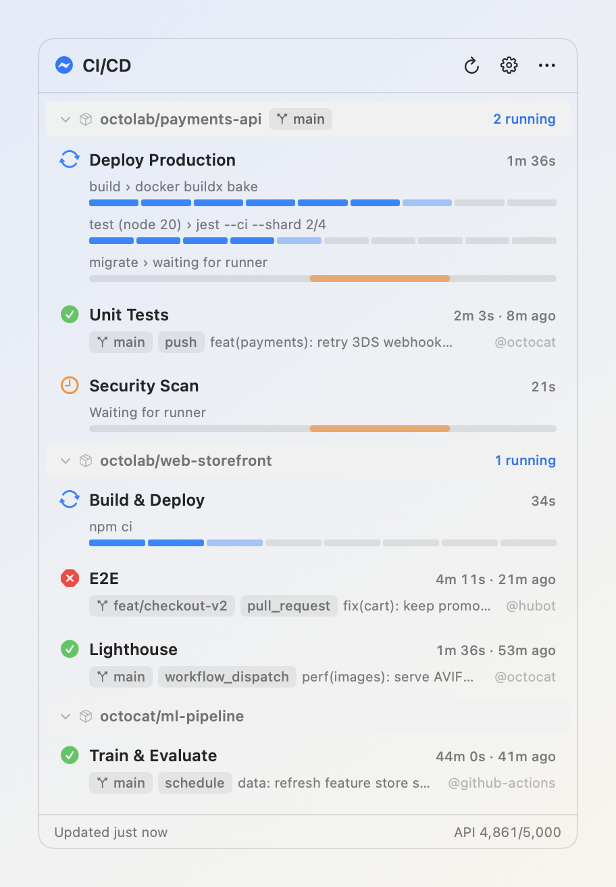
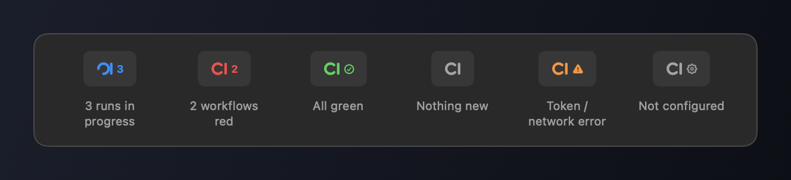
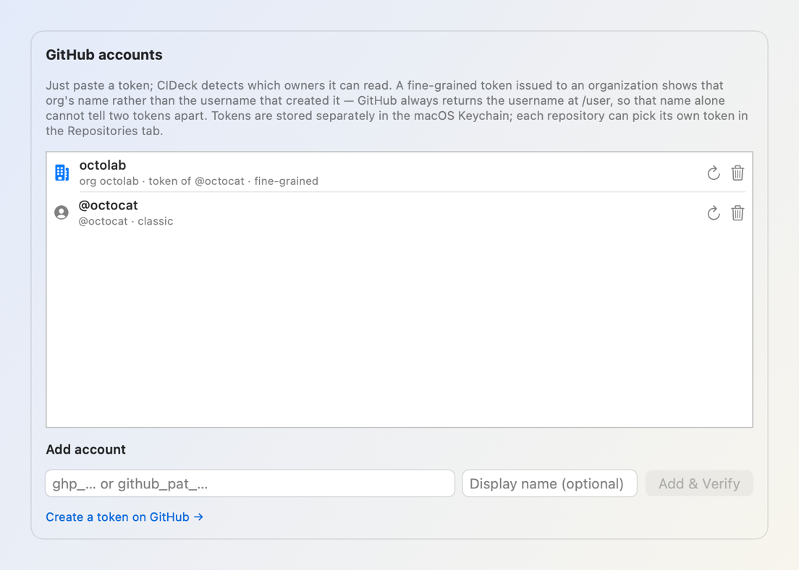
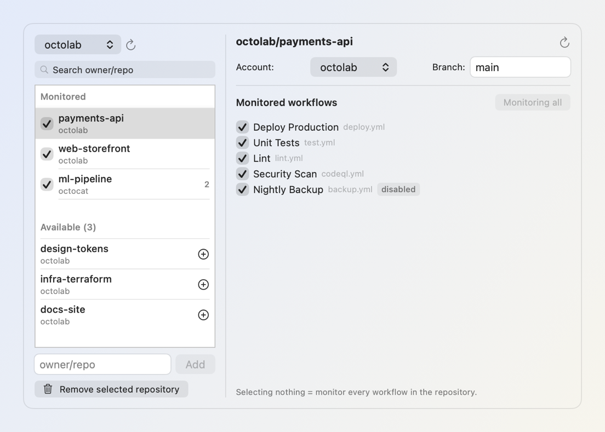
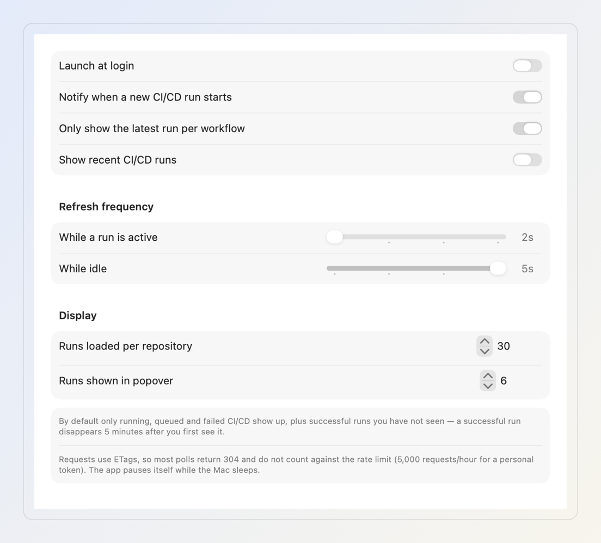

# CIDeck

**A macOS menu bar app for monitoring GitHub Actions.** Click the icon in the upper-right corner to open a compact popover showing CI/CD activity for the repositories you care about, including per-step progress bars for every job.

<p>
  
  
  
  
</p>

<picture>
  <source media="(prefers-color-scheme: dark)" srcset="docs/popover-dark.png">
  
</picture>

> Every image in this README is generated automatically with **mock data** (`CIDECK_DEMO=1`), not real repositories. See [Demo and screenshot generation](#demo-and-screenshot-generation).

---

## Table of contents

- [Features](#features)
- [Menu bar icon](#menu-bar-icon)
- [Requirements](#requirements)
- [Build and installation](#build-and-installation)
- [Configuration](#configuration)
- [Reading a run row](#reading-a-run-row)
- [Polling, ETags, and rate limits](#polling-etags-and-rate-limits)
- [Demo and screenshot generation](#demo-and-screenshot-generation)
- [Source structure](#source-structure)
- [GitHub APIs](#github-apis)
- [Troubleshooting](#troubleshooting)
- [Known limitations](#known-limitations)

---

## Features

| | |
|---|---|
| **Menu bar extra** | Uses `LSUIElement`, so it takes no space in the Dock or ⌘Tab. Its custom-drawn “CI” mark changes with the aggregate status and spins while a run is active. |
| **Multiple accounts and organizations** | Stores multiple Personal Access Tokens separately in Keychain. CIDeck detects which owners each token can read, and each repository selects the correct token. |
| **Repository discovery** | Select an account to list every accessible repository, including organization repositories through `/orgs/{org}/repos`, then click `+`. You can also paste `owner/repo`, a GitHub URL, or `git@github.com:owner/repo.git`. |
| **Workflow and branch filters** | Select individual workflows for each repository (no selection means all workflows) and optionally restrict monitoring to one branch. |
| **Real progress** | For active runs, CIDeck loads jobs and displays each parallel job as its own progress bar, divided into steps. The active step pulses. |
| **ETA** | Estimated from completed work or the median duration of previous successful runs for the same workflow. |
| **Self-cleaning list** | By default, shows active, queued, and failed runs plus successful runs **you have not seen**. Seen successes disappear after five minutes. |
| **macOS notifications** | New runs trigger a notification containing the workflow, branch, and commit. Click it to open the run. |
| **Adaptive polling** | Polls every 2 seconds during active runs and every 5 seconds while idle (configurable). Pauses during sleep, refreshes after wake, and backs off to 120 seconds when fewer than 100 rate-limit requests remain. |
| **Keychain storage** | Never writes tokens to configuration files or logs, and sends them only to `api.github.com`. |
| **Read-only** | Tokens only need read access. CIDeck has no re-run or cancel actions. |
| **English UI** | All interface strings and localization fallbacks are in English. |

Click a run to open it on GitHub. Right-click for *Copy link* or *Copy commit SHA*. Click a repository name to collapse its group.

## Menu bar icon



macOS renders status item images as templates, so color may be ignored. Each state therefore uses a distinct **shape**: the “CI” arc spins while runs are active, other states add a dedicated SF Symbol, and counts appear beside the mark when useful.

## Requirements

- macOS 13 Ventura or later (`MenuBarExtra`).
- Xcode or Xcode Command Line Tools: `xcode-select --install`.
- A GitHub Personal Access Token with read access to Actions.

## Build and installation

```bash
git clone <repo-url> ci-deck && cd ci-deck
chmod +x scripts/build-app.sh

./scripts/build-app.sh            # → build/CIDeck.app
./scripts/build-app.sh --install  # → /Applications/CIDeck.app

open build/CIDeck.app
```

Prebuilt versions are published on the repository's **Releases** page. A tag such
as `v0.0.1` triggers GitHub Actions to build the app, create a ZIP archive and
publish its SHA-256 checksum alongside the release.

The app is signed ad hoc, so macOS may block its first launch. Choose **System Settings → Privacy & Security → Open Anyway**.

For quick development:

```bash
swift run
```

> `swift run` launches a bare executable **without an `.app` bundle**. The menu bar icon may not appear and Launch at Login cannot be registered. Use `./scripts/build-app.sh` to run the real app bundle.

## Configuration

Open CIDeck, click its menu bar icon, then click ⚙.

### 1. GitHub tab — tokens

<picture>
  <source media="(prefers-color-scheme: dark)" srcset="docs/settings-accounts-dark.png">
  
</picture>

Paste a token and click **Add & Verify**. CIDeck calls `/user` and `/user/orgs` to assign a name and record which owners the token can actually read.

| Token type | Required permissions |
|---|---|
| Fine-grained (`github_pat_…`) | Select the required repositories, then grant **Actions: Read-only** and **Metadata: Read-only**. |
| Classic (`ghp_…`) | Use the `repo` scope for private repositories or `public_repo` for public repositories. |

You can add any number of tokens; each is stored as a separate Keychain item. A fine-grained token issued to an organization shows the **organization name** rather than the username that created it, because `/user` alone cannot distinguish those tokens.

### 2. Repositories tab — repositories and workflows

<picture>
  <source media="(prefers-color-scheme: dark)" srcset="docs/settings-repositories-dark.png">
  
</picture>

- Select an account at the top to show all repositories its token can read, then click `+`.
- Alternatively, enter `owner/repo` in the field at the bottom; GitHub URLs are accepted too.
- Use the checkbox beside a repository to enable or disable monitoring without removing it.
- Select a repository to change its account, filter its branch, and choose workflows. Selecting none monitors all workflows; disabled GitHub workflows carry a `disabled` chip.

### 3. General tab — behavior

<picture>
  <source media="(prefers-color-scheme: dark)" srcset="docs/settings-general-dark.png">
  
</picture>

| Option | Meaning |
|---|---|
| Launch at login | Registers a login item with `SMAppService`; this only works from a signed `.app` bundle. |
| Notify when a new CI/CD run starts | Notifies you about unseen runs. The first refresh establishes a baseline and does not notify you about old history. |
| Only show the latest run per workflow | Combines repeated runs of the same workflow into one row. |
| Show recent CI/CD runs | Includes recent history when enabled. By default, only runs needing attention appear. Cancelled runs are always hidden. |
| Refresh frequency | Active and idle polling intervals from 2–5 seconds. |
| Runs loaded per repository | API result count from 10–100. More history improves ETA accuracy. |
| Runs shown in popover | Number of rows rendered for each repository, from 1–20. |

## Reading a run row

```
 ⟳  Deploy Production                              1m 36s     ← status · workflow · elapsed time
    build › docker buildx bake                                ← job › active step
    ▓▓▓▓▓▓░░░                                                 ← one cell per step; active cell pulses
    test (node 20) › jest --ci --shard 2/4                    ← second parallel job and separate bar
    ▓▓▓▓░░░░░░
    migrate › waiting for runner                              ← job without a step; indeterminate bar
```

- Completed runs become compact rows with branch and event chips, commit title, `@actor`, total duration, and timestamp.
- Hover over a row for details: `#run number · SHA · status · branch · x/y jobs · ≈ 1m 20s left`.
- Each repository header shows its branch filter, when set, and active-run count.

**ETA** first extrapolates from elapsed time after a run passes 15% completion. Before that, it uses the **median duration of up to five recent successful runs** for the same workflow. Estimates outside 5 seconds–6 hours are discarded.

## Polling, ETags, and rate limits

CIDeck stores each response ETag and sends `If-None-Match` on later requests to the same path. GitHub returns `304 Not Modified` when nothing changed, and **304 responses do not count against the primary rate limit**, making two-second polling practical.

- The loop switches between `activeInterval` and `idleInterval` automatically.
- Job endpoints are requested **only** for active runs, never for history.
- Each repository's workflow list is loaded once and cached.
- Polling stops during sleep and refreshes immediately after wake.
- Fewer than 100 remaining requests triggers a 120-second interval.
- Changing or removing a token clears the ETag cache to avoid mixing identities.

The remaining quota appears in the popover footer (`API 4,861/5,000`) and turns orange when low.

## Demo and screenshot generation

Demo mode uses mock data from `Sources/CIDeck/Demo/DemoData.swift`. It needs no token, makes no network calls, and **does not alter your real configuration**; `UserDefaults` writes are disabled.

```bash
# Run the app with mock data
CIDECK_DEMO=1 swift run

# Regenerate every image in docs/ and exit
CIDECK_DEMO=1 CIDECK_SHOTS="$PWD/docs" swift run
```

Screenshots are rendered with `NSHostingView` and `cacheDisplay` in an off-screen window in light and dark appearances. This needs no Screen Recording permission and produces consistent output.

## Source structure

```
Sources/CIDeck/
  CIDeckApp.swift              @main — MenuBarExtra and settings window
  Models/
    GitHubModels.swift         API payloads and run state models
    AppSettings.swift          accounts, repositories, intervals, and UserDefaults persistence
  Services/
    Keychain.swift             token storage by account ID
    GitHubClient.swift         URLSession actor, ETag cache, and rate-limit headers
    RunsStore.swift            adaptive polling, progress, ETA, and display filters
    NotificationService.swift  new-run notifications and GitHub links
  Views/
    PopoverView.swift          menu bar popover
    RunRowView.swift           run row and progress bars
    SettingsView.swift         three configuration tabs
    MenuBarLabel.swift         menu bar icon
    CIMark.swift               vector “CI” mark with a rotating arc
    Components.swift           StatusIcon, RunProgressBar, Chip, EmptyStateView…
  Demo/
    DemoData.swift             documentation fixtures
    ScreenshotRunner.swift     renders PNG files into CIDECK_SHOTS
  Utils/Formatters.swift       durations, relative times, and truncation
  Resources/{en,vi}.lproj/     Localizable.strings
Resources/Info.plist           LSUIElement = true
scripts/build-app.sh           assembles and signs the app bundle
scripts/make-icon.swift        generates AppIcon.icns
docs/                          README images
```

## GitHub APIs

| Purpose | Endpoint | Frequency |
|---|---|---|
| Verify tokens and name accounts | `GET /user`, `GET /user/orgs` | When adding a token or re-detecting its scope |
| List available repositories | `GET /user/repos`, `GET /orgs/{org}/repos` | When opening the Repositories tab |
| List workflows | `GET /repos/{o}/{r}/actions/workflows` | Once per repository, then cached |
| List runs | `GET /repos/{o}/{r}/actions/runs` | Every poll, with ETags |
| Load jobs for progress | `GET /repos/{o}/{r}/actions/runs/{id}/jobs` | Active runs only |

Personal tokens have a 5,000-request hourly limit. With three idle repositories polling every five seconds, nearly every unchanged request returns `304` and does not consume that limit.

## Troubleshooting

| Symptom | Cause and solution |
|---|---|
| `swift run` shows no menu bar icon | The bare executable has no bundle. Run `./scripts/build-app.sh`, then `open build/CIDeck.app`. |
| Organization repositories do not appear under Available | The organization has not approved the fine-grained token, or Metadata: Read-only is missing. Refresh the account to detect its scope again. |
| The popover is empty while CI is running | A branch filter may not match, or different workflows may be selected. Check the repository's settings panel. |
| A successful run disappears | This is intentional: seen successes disappear after five minutes. Enable **Show recent CI/CD runs** to retain them. |
| No notifications appear | Check System Settings → Notifications → CIDeck. macOS may reject notification permission for an unsigned `swift run` executable. |
| Launch at Login turns itself off | Login items can only be registered by a signed `.app`; build the bundle and enable it again. |
| `API 0/5,000` | The quota is exhausted. CIDeck backs off to 120 seconds and recovers when the rate-limit window resets. |

## Known limitations

- **Read-only.** CIDeck cannot re-run, cancel, or display logs, so tokens only need read access.
- **ETA is an estimate.** Matrix size changes, runner queues, and cache misses can reduce accuracy.
- **Cancelled runs are always hidden.** Most are superseded by a newer push and say little about workflow health.
- macOS renders menu bar icons as templates, so **color may be ignored**; each state therefore uses a different shape.
- README screenshots use `cacheDisplay`, so macOS vibrancy and material effects appear flatter than in the real app.
